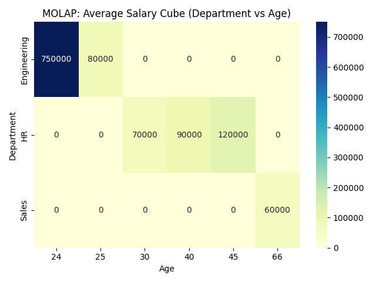
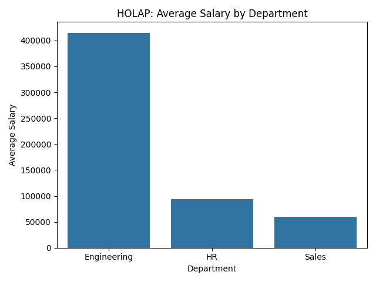

# OLAP Demo with Python, Pandas, and SQLite

## Introduction

This project demonstrates fundamental OLAP (Online Analytical Processing) operations using Python, pandas, and SQLite. OLAP enables users to analyze multidimensional data interactively from multiple perspectives. The three main OLAP models—ROLAP (Relational OLAP), MOLAP (Multidimensional OLAP), and HOLAP (Hybrid OLAP)—are illustrated in this demo, along with classic OLAP operations such as slice, dice, drill down, and roll up.

## Project Structure

- `olap_demo_script.py`: The main script containing all code for data creation, OLAP operations, and output.
- `OLAP.ipynb`: The original Jupyter notebook version (optional for interactive exploration).
- `olap_demo.db`: The SQLite database file created during execution (auto-generated).

## Technologies Used

- Python 3.13+
- pandas: For data manipulation and in-memory aggregation (MOLAP).
- numpy: For numerical operations.
- sqlite3: For relational database operations (ROLAP).
- matplotlib/seaborn: For visualization (used in the notebook).

## Data Description

Two tables are created:

- **employees**: Contains employee ID, name, age, salary, and department ID.
- **departments**: Contains department ID and department name.

Sample data:

| emp_id | name    | age | salary  | dept_id |
|--------|---------|-----|---------|---------|
| 1      | Mark    | 30  | 70000   | 1       |
| 2      | John    | 25  | 80000   | 2       |
| 3      | Charlie | 45  | 120000  | 1       |
| 4      | Will    | 66  | 60000   | 3       |
| 5      | Daniel  | 24  | 750000  | 2       |
| 6      | Gabriel | 40  | 90000   | 1       |

| dept_id | dept_name   |
|---------|-------------|
| 1       | HR          |
| 2       | Engineering |
| 3       | Sales       |

## Step-by-Step Procedures and Outcomes

### 1. Database Setup

The script creates a SQLite database and loads the synthetic employee and department data into two tables. This step is crucial for demonstrating ROLAP, which operates on relational databases.


### 2. ROLAP Operation (Relational OLAP)

ROLAP leverages SQL queries to perform OLAP operations directly on relational databases. Here, the average salary for each department is calculated using a SQL `GROUP BY` query.


**Output:**

| dept_name   | avg_salary   |
|-------------|--------------|
| Engineering | 415000.00    |
| HR          | 93333.33     |
| Sales       | 60000.00     |

**What this shows:**

This output reveals that the Engineering department has a much higher average salary compared to HR and Sales. This is due to one very high salary (Daniel, 750,000) in Engineering, which skews the average upward. HR has a moderate average, while Sales, with only one employee, has the lowest average salary. This demonstrates how outliers and department size can impact aggregate statistics in OLAP analysis.

**Visualization:**

In the original notebook, this result is visualized as a bar plot showing the average salary by department. The x-axis represents department names, and the y-axis shows the average salary. Each bar's height corresponds to the average salary for that department, making it easy to compare departments at a glance.


### 3. MOLAP Operation (Multidimensional OLAP)

MOLAP uses in-memory data structures (data cubes) for fast aggregation and analysis. A pivot table is created to show the average salary by department and age.


**Output:**

| age         | 24      | 25     | 30     | 40     | 45      | 66     |
|-------------|---------|--------|--------|--------|---------|--------|
| Engineering | 750000  | 80000  | 0      | 0      | 0       | 0      |
| HR          | 0       | 0      | 70000  | 90000  | 120000  | 0      |
| Sales       | 0       | 0      | 0      | 0      | 0       | 60000  |

**What this shows:**

This pivot table (data cube) shows the distribution of salaries across both department and age. For example, Engineering has two employees: one aged 24 with a very high salary (750,000) and one aged 25 (80,000). HR has employees at ages 30, 40, and 45, with salaries of 70,000, 90,000, and 120,000 respectively. Sales has a single employee aged 66 with a salary of 60,000. This output makes it clear which age groups are represented in each department and highlights salary disparities both within and across departments.

**Visualization:**

In the notebook, this data cube is visualized as a heatmap. The heatmap's axes represent departments and ages, and the color intensity of each cell reflects the average salary for that department-age combination. This makes it easy to spot trends, such as which age groups have the highest salaries in each department.




### 4. HOLAP Operation (Hybrid OLAP)

HOLAP combines ROLAP and MOLAP, using both SQL and in-memory aggregation. Detailed data is fetched with SQL, then aggregated in pandas.


**Output:**

| dept_name   | salary      |
|-------------|-------------|
| Engineering | 415000.00   |
| HR          | 93333.33    |
| Sales       | 60000.00    |

**What this shows:**

The HOLAP summary confirms the findings from both the ROLAP and MOLAP steps: Engineering's average salary is much higher than the other departments, again due to the outlier. This demonstrates the consistency of results across different OLAP approaches and highlights the importance of understanding the underlying data distribution when interpreting aggregates.

**Visualization:**

In the notebook, the HOLAP summary is also visualized as a bar plot, similar to the ROLAP result. This helps confirm that both approaches yield the same aggregated values, and allows for easy visual comparison.




### 5. OLAP Operations: Slice, Dice, Drill Down, Roll Up

- **Slice (Engineering Department):**


      This output isolates the Engineering department, showing only its employees and their salaries. Here, we see that Daniel's salary (750,000) is much higher than John's (80,000), which explains the high average for Engineering. This kind of slice operation is useful for focusing on a single group and identifying internal disparities or outliers.

| name   | dept_name   | salary  |
|--------|-------------|---------|
| John   | Engineering | 80000   |
| Daniel | Engineering | 750000  |

- **Dice (HR Department with Salary > 60000):**


      This output filters for HR employees with salaries above 60,000. It shows that all three HR employees meet this criterion, with Charlie earning the most (120,000). Dice operations like this help identify high performers or specific subgroups within a larger dataset.

| name    | dept_name | salary  |
|---------|-----------|---------|
| Mark    | HR        | 70000   |
| Charlie | HR        | 120000  |
| Gabriel | HR        | 90000   |

- **Drill Down (Salary by Employee and Department):**


      This output lists every employee, their department, and their salary, providing the most granular view of the data. It allows for direct comparison between individuals and departments, and can help spot outliers, salary gaps, or other patterns that might be hidden in aggregated data.

| name    | dept_name   | salary  |
|---------|-------------|---------|
| Mark    | HR          | 70000   |
| John    | Engineering | 80000   |
| Charlie | HR          | 120000  |
| Will    | Sales       | 60000   |
| Daniel  | Engineering | 750000  |
| Gabriel | HR          | 90000   |

- **Roll Up (Total Salary by Department):**


      This output aggregates salaries by department, showing the total salary cost for each. Engineering's total is much higher than the others, again due to Daniel's salary. Roll up operations are useful for budgeting, resource allocation, and understanding the overall structure of the data at a summary level.

| dept_name   | salary   |
|-------------|----------|
| Engineering | 830000   |
| HR          | 280000   |
| Sales       | 60000    |

    

## How to Run

1. Ensure you have Python 3.13+ and the required packages (`pandas`, `numpy`, `sqlite3`) installed.
2. Run the script:
   ```
   python olap_demo_script.py
   ```
3. Review the printed outputs for each OLAP operation.

## Conclusion

This demo provides a comprehensive introduction to OLAP concepts using Python and SQLite. By walking through ROLAP, MOLAP, and HOLAP, and demonstrating classic OLAP operations, it offers a practical foundation for anyone interested in data analysis, business intelligence, or data warehousing.

## License

MIT License 

## Author

Bophine Arnold 
